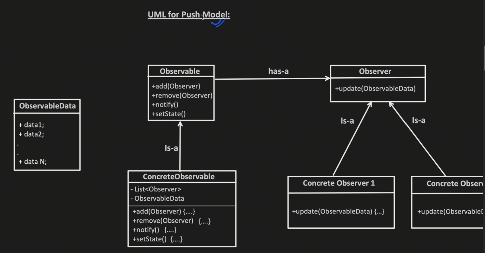
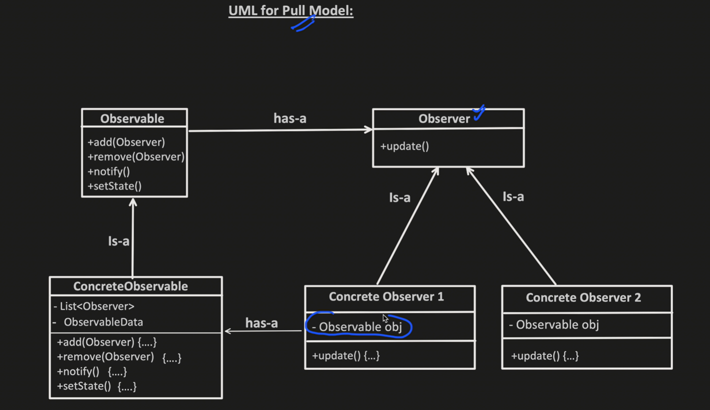
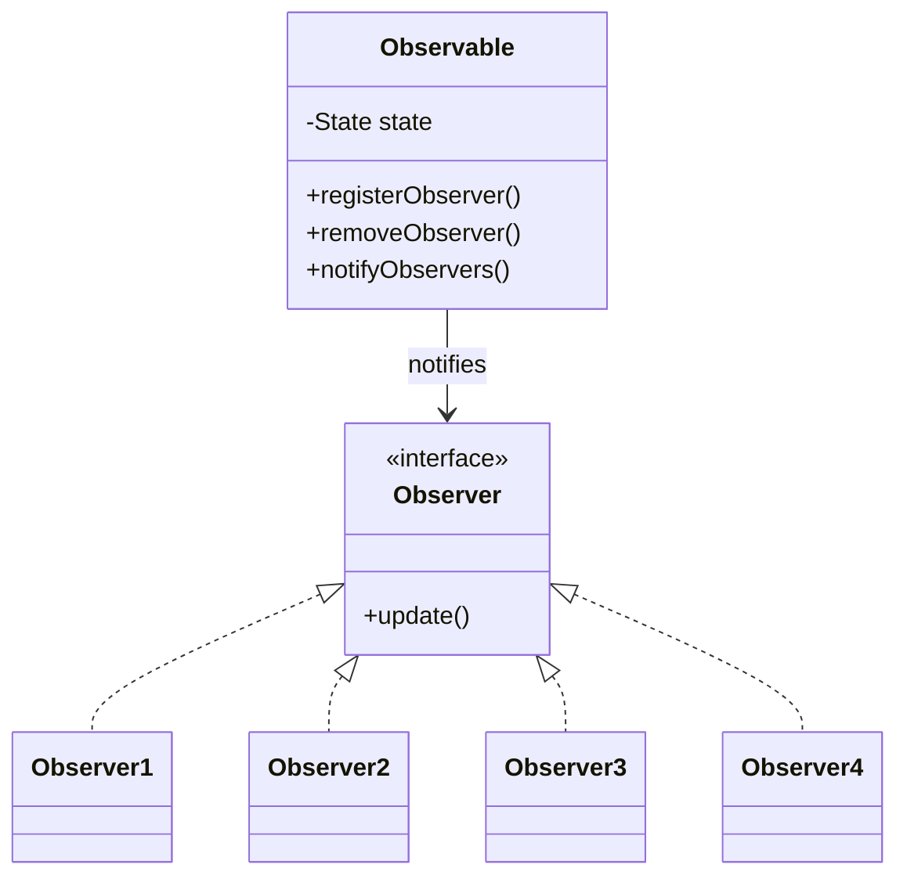

## Observer Design Pattern

### 📌 Overview
The **Observer Design Pattern** defines a **one-to-many dependency** between objects so that when one object (Observable / Publisher) changes its state, all dependent objects (Observers / Subscribers) are notified automatically.

It follows the **Publisher–Subscriber** model and promotes **loose coupling**.

* It's a design pattern where an object (aka "observable" or "publisher") maintains alist of dependents (called observers)
* And automatically notifies the dependents/observers whenever there is a change in states
---

The Observer Pattern solves this by **decoupling** the subject from its observers.

---

### 🧩 Components

#### 1️⃣ Observable (Publisher)
- Maintains the state
- Registers and removes observers
- Notifies observers when state changes

#### 2️⃣ Observer (Subscriber)
- Depends on the observable
- Gets notified automatically on state changes

#### 2 Models:
1. Push: Observer pushes the data it wants observer to receive.
2. Pull: Observer holds observable object reference and when it got to know something updated, it pulls the data whatever it needs using observavle object.

---

### 🧱 UML Diagram

### 🔄 Working Flow

1. Observers subscribe to the Observable 
2. Observable maintains a state (Value1, Value2, Value3)
3. When the state changes:
   1. Observable calls notifyObservers()
   2. All registered observers receive the update

### 🧪 Real-World Examples
- YouTube channel → Subscribers 
- Stock price updates → Trading apps 
- Weather station → Display devices 
- Event listeners in UI frameworks

### ✅ Advantages
- Loose coupling between objects 
- Easy to add or remove observers 
- Follows Open/Closed Principle 
- Promotes scalable design

### ❌ Disadvantages
- Notification order is not guaranteed 
- Performance impact if too many observers 
- Harder debugging due to indirect updates

### 📦 When to Use
- Multiple objects depend on one object 
- State changes must propagate automatically 
- You want a decoupled event-driven system