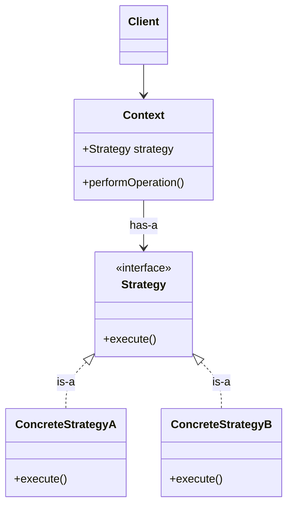

## Strategy Design Pattern
- it's a behavioural design pattern that defines multiple algorithms, encapsulates their logic in dedicated classes, and enables changing and algorithm behaviour at runtime.
- it's useful when you have multiple ways to perform a task and want to choose approach dynamically.

---
#### Problems without Strategy Pattern
* Code duplication: Same functionality could be present in multiple subClasses.
* Tight Coupling: In future if we need to change any functionality, we need to update the class

#### UML

* independently we can scale the driving strategy
* and scale the type of vehicles
* and also can dynamically manage the driving strategy for the vhicle